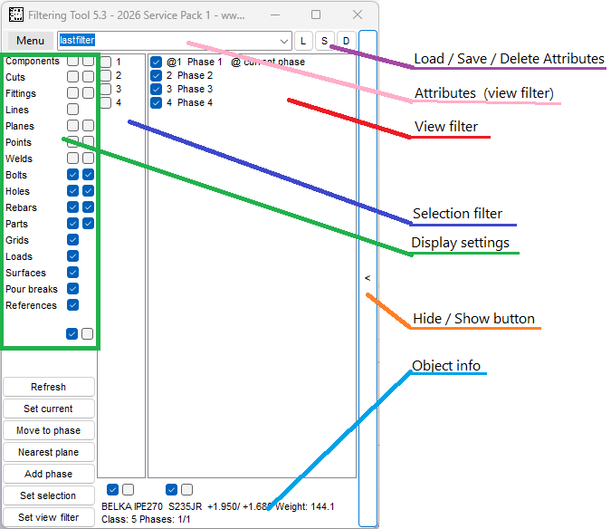

# Filtering Tool Plugin for Tekla Structures

[](LICENSE)
[](https://www.tekla.com/)


A plugin for Tekla Structures that speeds up day‑to‑day modelling work by making it easy to filter the model by **phase**.

The tool runs as a small floating window listing every phase in the open model. Check the phases you want to see, **right‑click** the list and the model views are redrawn instantly with a matching view filter (or selection filter). No more clicking through Tekla’s standard filter dialogs.



## Key features

- **View filter by phase** — apply to all views or only the selected views with a single right‑click.
- **Selection filter by phase** — restrict mouse selection to objects in the chosen phases.
- **Phase management** — add, rename, set current phase, and move selected objects between phases.
- **Import / export phases** — share phase sets between models.
- **Save / load attribute presets** — keep multiple view‑display configurations and switch between them.

## Supported Tekla Structures versions

Tekla Structures **20.0-21.1** and **2016-2099**. Two TSEP installers are provided — one for Tekla 2016 – 2024 and a separate one for Tekla 2025+.

## Installation

1. Download the latest `.tsep` installer from the [Tekla Warehouse](https://warehouse.tekla.com/#/packages/1bb17384-ba70-4059-9067-67d9de469390)
2. Close all Tekla Structures programs.
3. Double‑click the `.tsep` file, select your tekla version and click install. Open Tekla Structures. 
4. If double click install fails then you can copy tsep file to ```%envFolder\Extensions\To be installed```
3. Open Tekla Structures. *Filtering Tool* will appear in the *Applications & components* catalog under the **DDBIM** group.

For very old Tekla Strucutres use msi installer.

## Usage

1. Open a model in Tekla Structures.
2. Double‑click **Filtering Tool** in the *Applications & components* catalog. A floating window opens listing all model phases.
3. Check the phases you want to filter by.
4. **Right‑click** the *View filter* list to apply a view filter, or right‑click the *Selection filter* list to apply a selection filter. The model views are redrawn immediately.

A short tutorial playlist is available on YouTube: <https://www.youtube.com/watch?v=j1X2EQKauk4&list=PLd8hKL2n3CMgLt4BpAG9kH68zSNUh8tdE>

In‑app help (Menu → Help) documents every individual feature, including multi‑select, set‑current‑phase, move‑objects‑to‑phase, weld‑1, nearest plane, object info and small‑window mode.

## Building from source

### Prerequisites

- Visual Studio 2022 or newer
- .NET Framework 4.8 developer pack

### Steps

1. Clone the repository and open `FilteringTool/FilteringTool.sln`.
2. Build the solution in *Debug*
3. Run the numbered batch scripts in `FilteringTool/FilteringTool/_Build/` in order to produce installers:

   | Script | Purpose |
   | --- | --- |
   | `01_Build.bat` | Build the main exe + plugin DLL |
   | `02_SignOutput.bat` | Code‑sign the binaries (optional) |
   | `03_CreateTsep.bat` / `03_CreateTsep_Signed.bat` | Package the TSEP for Tekla |
   | `04_Reinstall_TSEP_2026.bat` | Convenience: reinstall the TSEP into a local Tekla 2026 install |
   | `05_Build_InstallerClass.bat` / `06_Sign_InstallerClass.bat` | Build / sign the installer class |
   | `07_Build_MSI.bat` / `08_Sign_MSI.bat` | Build / sign the MSI |
   | `98_Uninstall_From_All.bat` | Remove all installed copies |

## Project structure

| Project | Purpose |
| --- | --- |
| `FilteringTool` | Main WinForms `.exe` — the floating phase‑list window. |
| `FilteringToolPlugin` | Tekla plugin DLL surfaced in the Tekla *Applications & components* catalog. Launches the exe. |
| `FilteringToolStarter` | Bootstrapper that copies the exe into a per‑Tekla‑version TEMP folder so the right Tekla Open API is loaded. |
| `FilteringToolSetup` / `FilteringToolSetup_InstallerClass` | MSI installer projects. |
| `FilteringToolTests` | NUnit unit tests. |

## License

MIT — see [`LICENSE`](LICENSE).

Copyright © 2018 Dawid Dyrcz.

## See also

Maybe you will like my other plugins like:

Alternative for [Tekla raling s77](https://ddbim.com/industrial-handrail-plugin/) - create complex ralings for industrial steel structures. 

[Tekla grating](https://ddbim.com/advanced-platform-grating-plugin/) plugin - create platform gratings and stairs with 3 clicks. 